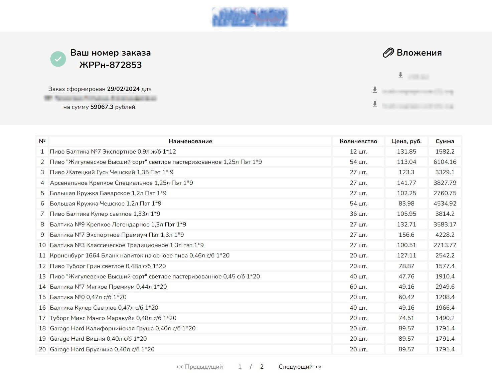

# FastAPI Order Information Project

This project provides web pages where users can view information about their order and download files attached to this order. After making a purchase, the user is sent a link to the page with his order, where he can see the details of the order and download the files.

## Features
- View order details
- View products of order in form of table
- Download attached files
- User-friendly interface

## Installation
1. Clone the repository:

   `git clone https://github.com/yourusername/fastapi-order-information.git`
   
2. Run docker container:

   `docker compose up --build`

3. Apply migrations to database:

   `docker-compose exec server bash -c "cd .. && alembic upgrade head"`
   
5. Navigate to http://localhost:80 in your web browser to access the application.

## Technologies Used
- Python
- FastAPI
- PostgreSQL
- HTML
- CSS

## Screenshots

